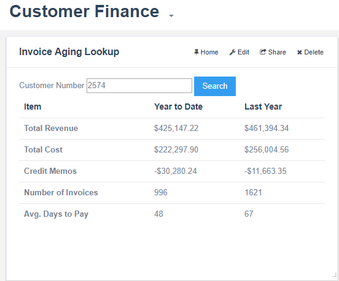

# CREDIT HOLD #
This bezl is used to provide sales managers and executives a financial overview for a customer that is similar to what is provided in the application under the finance tab in customer tracker.

