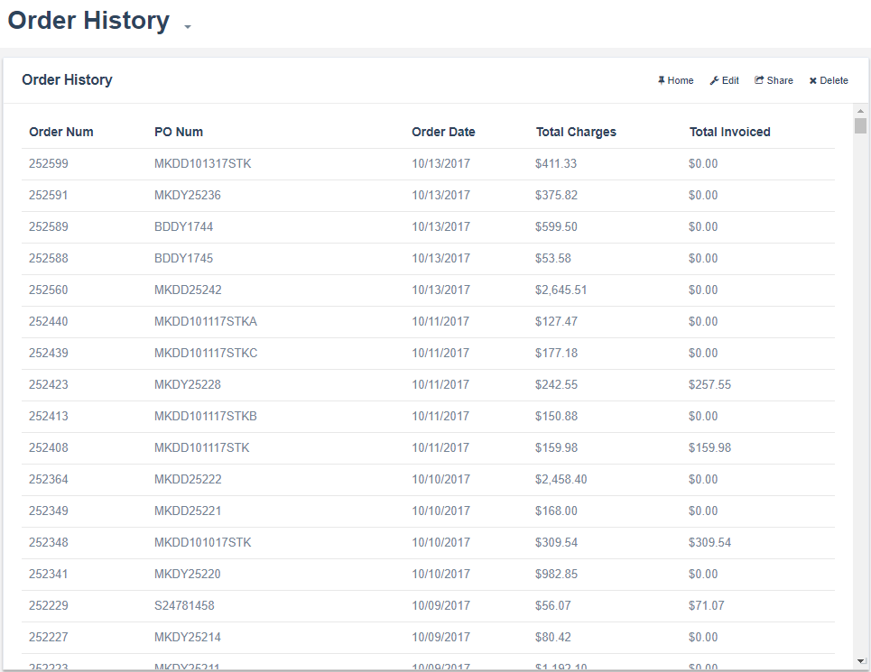

# Order History
This generates a list of orders for the last 12 months. The SQL used to generate this list
filters based on the email that is being used to login to Bezlio, so an order only gets 
added to the list if the email is also listed on the account in Epicor.

